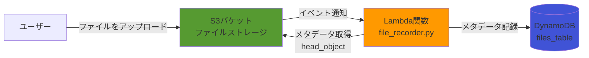
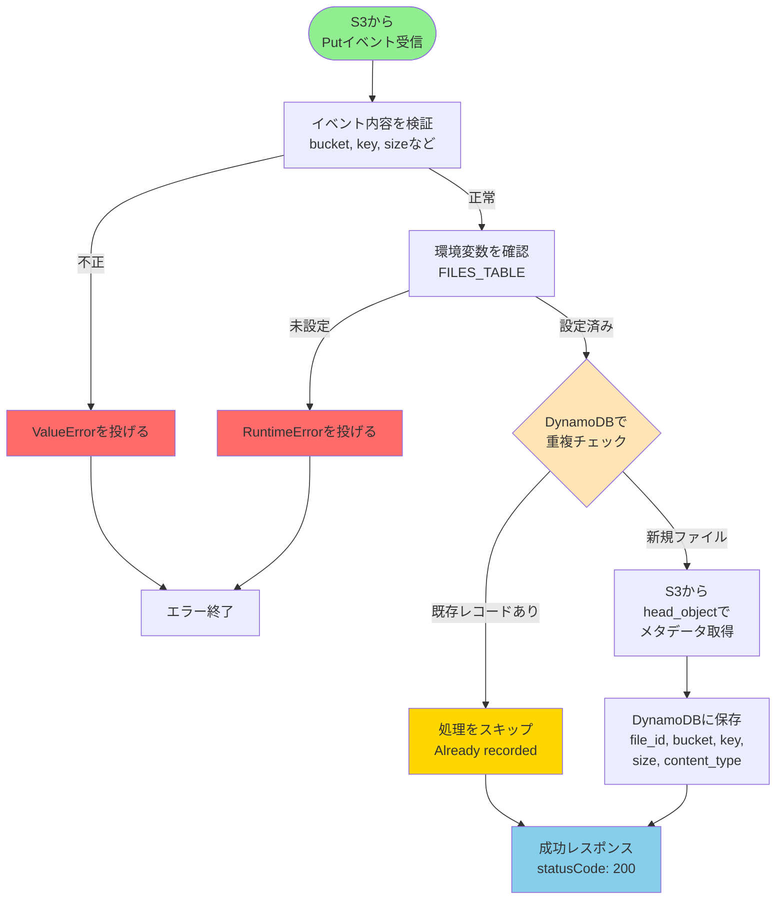
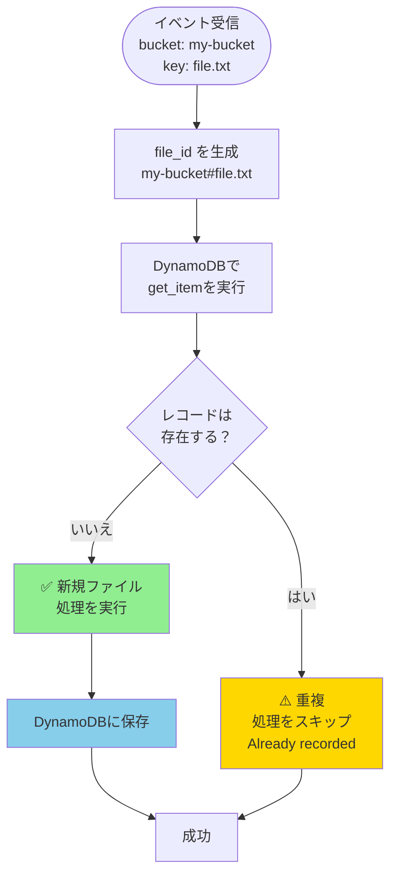

# 概要設計 - ファイルアップロード記録システム

## 背景
S3バケットにファイルがアップロードされると、自動的にLambda関数が起動し、ファイルのメタデータをDynamoDBに記録するシステムです。このLambda関数は後からテストを追加する想定で、ユニットテストが未整備の状態です。

## Lambda関数が初めての方へ

### Lambdaとは？
AWS Lambdaは、サーバーを管理することなくコードを実行できるサービスです。

**従来のサーバー方式:**
```
サーバー（常時起動） → 電気代がかかる、メンテナンスが必要
```

**Lambda方式:**
```
イベント発生時のみ起動 → コスト削減、自動スケール
```

### イベント駆動とは？
「何かが起きたら自動的に処理が始まる」仕組みです。

**例:**
```
S3にファイルをアップロード
  ↓（イベント通知）
Lambda関数が自動起動
  ↓
処理を実行
```

このワークショップでは、この仕組みをテストする方法を学びます。

---

## 用語集

### AWSサービス

| 用語 | 説明 | 本システムでの役割 |
|------|------|------------------|
| **Lambda** | サーバーレスでコードを実行 | S3イベントを受け取り、DynamoDBにデータを保存 |
| **S3 (Simple Storage Service)** | ファイルを保存するストレージ | ファイルの保存とイベント通知の発行 |
| **DynamoDB** | NoSQL型データベース | ファイルのメタデータ（ファイル名、サイズなど）を保存 |

### 重要な概念

| 用語 | 説明 |
|------|------|
| **イベント** | 何かが起きたことを知らせるメッセージ（例: 「ファイルがアップロードされた」） |
| **メタデータ** | データについてのデータ（例: ファイル名、サイズ、アップロード日時） |
| **重複チェック** | 同じファイルを2回記録しないための仕組み |
| **べき等性** | 同じ処理を何度実行しても結果が同じになる性質 |

---

## アーキテクチャ概要

### システム全体図



**処理の流れ:**
1. ユーザーがS3にファイルをアップロード
2. S3がLambdaにイベント通知を送信
3. LambdaがS3からファイルのメタデータを取得
4. LambdaがDynamoDBにメタデータを保存

---

### 処理フロー



**処理ステップの詳細:**

| ステップ | 説明 | 重要ポイント |
|---------|------|------------|
| ① Validate | イベントが正しい形式かチェック | bucket, key, size が揃っているか |
| ② CheckEnv | 環境変数を確認 | FILES_TABLE が設定されているか |
| ③ CheckDup | 重複チェック | **最重要**: 同じファイルを2回記録しないための仕組み |
| ④ GetMeta | S3からメタデータ取得 | Content-Type, Last-Modified など |
| ⑤ SaveDB | DynamoDBに保存 | file_id, bucket, key, size, content_type |

---

## イベントコンテンツ - S3 Putイベント

S3がLambdaに送信するイベントは、以下のような構造です。

### イベント構造

```json
{
  "Records": [
    {
      "eventVersion": "2.1",
      "eventSource": "aws:s3",
      "eventName": "ObjectCreated:Put",
      "s3": {
        "bucket": {
          "name": "my-upload-bucket"
        },
        "object": {
          "key": "uploads/report.pdf",
          "size": 102400
        }
      }
    }
  ]
}
```

### 重要なフィールド

| フィールドパス | 型 | 説明 | 例 |
|--------------|-----|------|---|
| `Records[0].s3.bucket.name` | string | バケット名 | `"my-upload-bucket"` |
| `Records[0].s3.object.key` | string | オブジェクトキー（ファイルパス） | `"uploads/report.pdf"` |
| `Records[0].s3.object.size` | number | ファイルサイズ（バイト） | `102400` (100KB) |
| `Records[0].eventName` | string | イベント名 | `"ObjectCreated:Put"` |

### イベントの種類

| eventName | 説明 | このシステムで処理する？ |
|-----------|------|----------------------|
| `ObjectCreated:Put` | 通常のアップロード | ✅ はい |
| `ObjectCreated:Post` | フォームアップロード | ✅ はい |
| `ObjectCreated:Copy` | コピー操作 | ✅ はい |
| `ObjectCreated:CompleteMultipartUpload` | マルチパートアップロード完了 | ✅ はい |
| `ObjectRemoved:Delete` | ファイル削除 | ❌ いいえ |

サンプルイベントは `samples/` ディレクトリを参照してください。

---

## データモデル - DynamoDBの `files_table`

### テーブル設計

| Attribute | Type | Description | 例 |
|-----------|------|-------------|---|
| `file_id` | **PK** (string) | ファイルの一意識別子<br/>`{bucket}#{key}` 形式 | `"my-upload-bucket#uploads/report.pdf"` |
| `bucket` | string | S3バケット名 | `"my-upload-bucket"` |
| `key` | string | S3オブジェクトキー | `"uploads/report.pdf"` |
| `size` | number | ファイルサイズ（バイト） | `102400` |
| `content_type` | string | MIMEタイプ | `"application/pdf"` |
| `uploaded_at` | string | アップロード日時（ISO 8601） | `"2025-03-01T10:30:00.000Z"` |

### file_id の設計

**なぜ `{bucket}#{key}` 形式？**

同じファイル名でも、バケットが違えば別のファイルです。

```
my-upload-bucket#uploads/report.pdf   ← 異なるファイル
backup-bucket#uploads/report.pdf      ← 異なるファイル
```

`#` で区切ることで、バケットとキーを一意に識別できます。

### データ例

```json
{
  "file_id": "my-upload-bucket#uploads/report.pdf",
  "bucket": "my-upload-bucket",
  "key": "uploads/report.pdf",
  "size": 102400,
  "content_type": "application/pdf",
  "uploaded_at": "2025-03-01T10:30:00.000Z"
}
```

---

## 重複チェックの仕組み

### なぜ重複チェックが必要？

S3イベントは、以下の理由で重複して送信される可能性があります。

1. **ネットワーク障害でのリトライ**
2. **S3の内部処理での重複送信**
3. **マルチパートアップロードでの複数イベント**

同じファイルを2回記録するとデータの整合性が崩れます。

### 重複チェックの処理フロー



### コードでの実装

```python
# file_id を生成
file_id = f"{bucket}#{key}"

# DynamoDBで重複チェック
existing = table.get_item(Key={"file_id": file_id})

if existing.get("Item"):
    # 既に存在する → スキップ
    return {"statusCode": 200, "body": "File already recorded"}

# 新規ファイル → 処理を実行
# ...
```

---

## 外部連携

### 1. S3（ストレージ）

```python
boto3.client("s3").head_object(Bucket=bucket, Key=key)
```

**用途:** ファイルのメタデータ取得

**取得できる情報:**
- `Content-Type`: MIMEタイプ（例: `application/pdf`）
- `Content-Length`: ファイルサイズ
- `Last-Modified`: 最終更新日時
- `Metadata`: カスタムメタデータ

### 2. DynamoDB（データベース）

```python
boto3.resource("dynamodb").Table(table_name)
```

**操作:**
- `get_item(Key={...})`: レコード取得（重複チェック用）
- `put_item(Item={...})`: レコード作成・更新

### 環境変数

| 環境変数 | 必須/任意 | デフォルト値 | 説明 |
|---------|---------|------------|-----|
| `FILES_TABLE` | **必須** | なし | DynamoDBテーブル名 |

**環境変数の設定例:**
```bash
FILES_TABLE=files_table
```

---

## エッジケースと既知のリスク

### 1. 重複イベント処理（最重要）
**問題:** 同じS3イベントが2回送信される可能性がある
**対策:** `file_id` で重複チェックを実施
**確認事項:** `get_item` で既存レコードを確認してから `put_item` を実行

### 2. 環境変数未設定
**問題:** `FILES_TABLE` が設定されていない
**対策:** `RuntimeError` を投げる
**影響:** Lambda関数が起動時にエラーで停止

### 3. S3 head_object の失敗
**問題:** ファイルが削除済み、または権限不足
**対策:** 例外をキャッチしてログ出力
**影響:** メタデータが取得できないが、基本情報（bucket, key, size）は記録

### 4. DynamoDB書き込み失敗
**問題:** テーブルが存在しない、または権限不足
**対策:** 例外をキャッチして再スロー
**影響:** Lambda関数がエラー終了し、リトライされる

---

## テスト重点項目

### 優先度1: 新規ファイルの記録

| テストケース | 期待される挙動 |
|------------|--------------|
| S3 Putイベントを受信 | DynamoDBに正しくレコードが作成される |
| file_id が正しい | `{bucket}#{key}` 形式で保存される |
| メタデータが正しい | bucket, key, size, content_type が正しい |

### 優先度2: 重複ファイルのスキップ

| テストケース | 期待される挙動 |
|------------|--------------|
| 既存レコードがある状態で同じイベント受信 | 処理をスキップ、DynamoDBは更新されない |
| レスポンスメッセージ | "File already recorded" が返る |

### 優先度3: 環境変数チェック

| テストケース | 期待される挙動 |
|------------|--------------|
| FILES_TABLE 未設定 | `RuntimeError` が発生 |

---

## 既知の実装上の課題

### 1. boto3クライアントの初期化位置

**問題:**
boto3クライアント（DynamoDB、S3）を関数の外で初期化している

```python
# 現在の実装（問題あり）
_dynamodb = boto3.resource("dynamodb")
_s3 = boto3.client("s3")

def lambda_handler(event, context):
    # ... 処理 ...
```

**影響:**
- ユニットテストで `moto` を使ったパッチが必要
- テストコードが複雑になる

**推奨改善策:**
```python
def lambda_handler(event, context):
    dynamodb = boto3.resource("dynamodb")  # 関数内に移動
    s3 = boto3.client("s3")
    # ... 処理 ...
```

### 2. エラーハンドリングの不足

**問題:**
S3 の `head_object` が失敗した場合の処理が不十分

**影響:**
- ファイルが削除済みの場合にエラーで停止
- Content-Type が取得できない

**推奨改善策:**
```python
try:
    metadata = s3.head_object(Bucket=bucket, Key=key)
    content_type = metadata.get("ContentType", "application/octet-stream")
except ClientError:
    content_type = "application/octet-stream"  # デフォルト値
```

### 3. ログの充実化

**問題:**
処理内容がログに記録されていない

**影響:**
- トラブルシューティングが困難
- 本番環境での問題特定に時間がかかる

**推奨改善策:**
```python
logger.info("Processing S3 event", extra={
    "bucket": bucket,
    "key": key,
    "size": size
})
```
